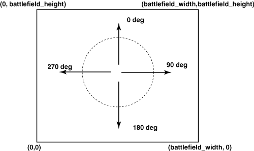

Robocode
========
_Build the best, destroy the rest!_

Github: [robo-code/robocode](https://github.com/robo-code/robocode)

**Version: 1.9.3.3**  
Prerequisites:  
- [Java JDK 6+](https://www.oracle.com/technetwork/java/javase/downloads/jdk8-downloads-2133151.html)
- [robocode-1.9.3.3-setup.jar](https://sourceforge.net/projects/robocode/files/robocode/1.9.3.3/)


Or follow the official [step by step instructions](http://robowiki.net/wiki/Robocode/System_Requirements).


`'java' is not recognized as an internal or external command`
[Add Java SDK to Path](http://robowiki.net/wiki/Robocode/System_Requirements#Setting_environmental_variables_on_Windows).


Youtube:  
- [Programming Games: Robocode // Patrick Cupka](https://www.youtube.com/watch?v=oTjjkXebCAY)
- [Walkthough of testing code for robocode // Philip Johnson](https://www.youtube.com/watch?v=dHrupYhq7sI)
- [Introduction to Robocode // Philip Johnson](https://www.youtube.com/watch?v=wJzJ57ZC1sc)


## Getting Started

Robot > Source Editor (Control + E) > New Robot (Control + N)

This will generate something like:
```java
public class MyRobot extends Robot
{
	public void run() {
		setColors(Color.red, Color.blue, Color.green); // body, gun, radar

		while(true) {
			ahead(100); // pixels
			turnGunRight(360); // degrees
			back(100);
			turnGunRight(360);
		}
	}

	public void onScannedRobot(ScannedRobotEvent e) {
		fire(1); // Strength between 0.1 and 3.0
	}

	public void onHitByBullet(HitByBulletEvent e) {
		back(10);
	}
	
	public void onHitWall(HitWallEvent e) {
		back(20);
	}	
}
```

Extend either `Robot` or `AdvancedRobot`. An AdvancedRobot:  
- Loses energy when bumping into walls. 
- Can have non-blocking calls, custom events and FileSystem access.

When you are ready for battle, use: Compiler > Compiler (Control + B) in the Source Editor.


### In Eclipse

New Project:  
- Libraries > Add External JARs...: Add `libs/robocode.jar`


Add the `bin` folder in the Robocode UI:  
Options > Preferences > Development Options > Add  


Be sure your final robot is [packaged](http://robowiki.net/wiki/Robocode/Package_Robot)!
A `*` appears ingame next to a robot's name if it is a development version.


### In Visual Studio

Download the [.NET plug-in for Robocode](https://sourceforge.net/projects/robocode/files/robocode/1.9.3.3/) and **install in the same directory as Robocode itself**!

Create a .NET Framework project and reference `libs\robocode.dll`.
See `dotnet-bots` for a minimal example. 

Add the `bin\Debug` folder in the Robocode UI:  
Options > Preferences > Development Options > Add  

[Wiki](http://robowiki.net/wiki/Robocode/.NET/Create_a_.NET_robot_with_Visual_Studio)


#### Debugging

Project > Properties > Debug:  
- Start external program: `C:\Program Files\Java\jdk1.8.0_211\bin\java.exe`
- Command line arguments: 
```
-Ddebug=true -Xmx512M -cp libs/robocode.jar;libs/jni4net.j-0.8.7.0.jar -XX:+IgnoreUnrecognizedVMOptions "--add-opens=java.base/sun.net.www.protocol.jar=ALL-UNNAMED" "--add-opens=java.base/java.lang.reflect=ALL-UNNAMED" "--add-opens=java.desktop/sun.awt=ALL-UNNAMED" robocode.Robocode
```
- Working directory: Where installed (ex: c:\robocode)

Be sure your final robot is a `Release` build!

[Wiki](http://robowiki.net/wiki/Robocode/.NET/Debug_a_.NET_robot_in_Visual_Studio)


### Other languages

Kotlin or Scala anyone?


## Game Physics



- Default grid for 1v1: 800x600
- Time is measured in ticks = turns.
- 1 distance unit = 1 pixel unless the game scaled down the battlefield to fit on the screen.
- Acceleration (a): Robots accelerate at 1px/turn and decelerate at 2px/turn.
- Velocity (v): Max: 8px/turn. Direction of the `GunHeading`.
- Distance (d): distance = velocity * time.


## The Robot

A Robot consists of:

### Body

- `Energy`: 
	- Start with 100.
	- Drops when firing, getting hit, running into robots or walls and being inactive
	- At 0, it is game over! 
- `Ahead(double distance)` & `Back`: Distance in pixels.
	- Collision with another robot: 0.6 energy damage
	- Collision with a wall `abs(velocity) * 0.5 - 1 (never < 0)` (AdvancedRobot only)
- `Velocity`: Measured in pixels/turn. Max: 8px/turn. Accelerate: 1px/turn. Decelerate: 2px/turn.
- `TurnLeft(double degrees)` & `TurnRight`
	- Maximum rate of rotation is `(10 - 0.75 * abs(velocity)) deg/turn`. The faster you're moving, the slower you turn.
- `Width` & `Height`: Dimensions of the Robot. (36x36)


### Gun

Pew! Pew!

- Mounted on the Body.
- `GunHeat`: Can only `Fire` when this is zero. Each turn the Gun cools with `GunCoolingRate`. Default: 0.1 / turn. At game start `GunHeat` is 3.
- `Fire` & `FireBullet(double power): Bullet`:
	- With `power` between 0.1 and 3.
    - Costs `power` amount of `energy`. If power > energy, you become disabled. 
	- Damage: `(4 * power)`. If power > 1, an additional `2 * (power - 1)` damage.
	- If hit, you regain `(3 * power)` worth of `energy`.  
	- `GunHeat` increases with `1 + (power / 5)`.
	- Generates `onBullHit`, `onBulletHitBullet` and `OnBulletMissed` events.
	- Bullets move with a velocity of `20 - (3 * power)`

    
- `turnGunLeft` and `turnGunRight`.
	- `GunHeading`: Direction the gun is facing. Returns 0 to 360 (exclusive). 0 is North. 90 is East etc.
	- The maximum rate of rotation is: 20 deg/turn.
	- `IsAdjustGunForRobotTurn`: True = Guns turns separately of Body.


### Radar

Scans for other robots.

- Mounted on the Gun.
- `turnRadarLeft(double degrees)` and `turnRadarRight`.
	- The maximum rate of rotation is: 45 deg/turn
- Generates `onScannedRobot` events when another robot is detected.
- `RadarHeading`: Direction the radar is facing.
- `IsAdjustRadarForGunTurn`: True = Radar turns separately of Gun.
- `IsAdjustRadarForRobotTurn`: True = Radar turns separately of Body.


[Wiki](http://robowiki.net/wiki/Robocode/Game_Physics)


## Debugging your robot

Start Robocode UI in debug mode:  
`java -Ddebug=true -Xmx512M ...`


See `out.println()` (or `Console.WriteLine()`) in your robot log by clicking on your robot name in the right top battle view pane in the UI. SYSTEM events and crash stack traces will also be printed in the robot console.


Battling other bots:
- [Sample Bots](http://robowiki.net/wiki/Sample_Bots): Packaged with Robocode. Practise against these first :)
- [Super Sample Bots](http://robowiki.net/wiki/Category:Super_Sample_Bots): The next step.
- [How to download other Robots](http://robowiki.net/wiki/Robocode/Learning_from_Robots)
- [Some Super Robots](http://robowiki.net/wiki/Robocode/Downloading_Robots#Robots_to_download)
- [Open Source Robots](http://www.robowiki.net/wiki/Category:Open_Source_Bots)
- [Robocode articles](http://robowiki.net/wiki/Robocode/Articles)


## CLI

`-battle debugging`: Debug battle result called "debugging".


[wiki](http://robowiki.net/wiki/Robocode/Console_Usage)


## UI Preferences

- Common Options
	- Enable auto recording
- Development Options
	- Add path with robots
- Rendering Options
	- Make all bullets white
- Sound Options
	- Enable Sound


Shortcuts:  
New Battle: Control + N
Screenshot: Control + T  
Editor: Control + E